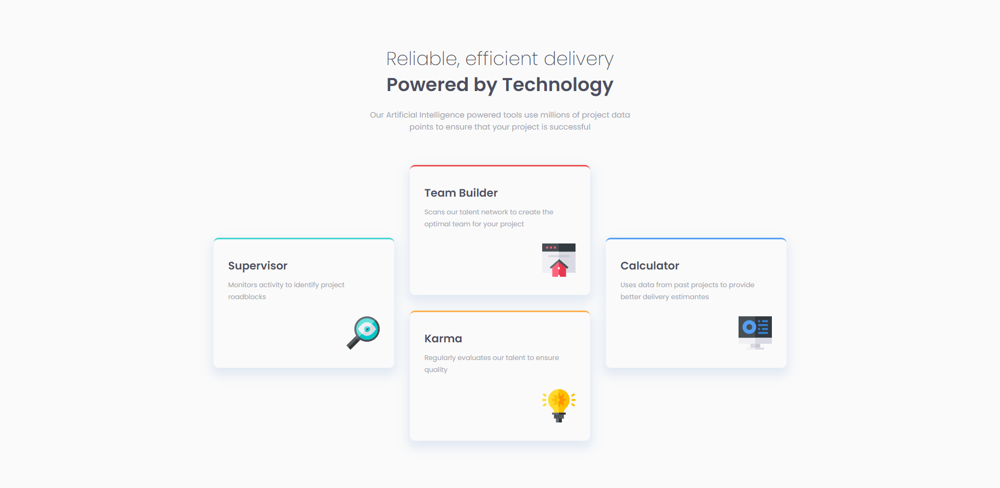

# Frontend Mentor - Four card feature section solution

This is a solution to the [Four card feature section challenge on Frontend Mentor](https://www.frontendmentor.io/challenges/four-card-feature-section-weK1eFYK). Frontend Mentor challenges help you improve your coding skills by building realistic projects. 

## Table of contents

- [Overview](#overview)
  - [Screenshot](#screenshot)
  - [Links](#links)
- [My process](#my-process)
  - [Built with](#built-with)
- [Author](#author)

## Overview

### Screenshot

### Links

- Solution URL: [solution]()
- Live Site URL: [live]()

## My process

### Built with

- Semantic, Validate HTML5 markup
- SCSS
- Grid 
- FlexBox

## Author

- Website - [Nazar Pasechnyi](https://www.linkedin.com/in/nazar-pasechnyi-2320a2320/)
- Frontend Mentor - [@Lackevil](https://www.frontendmentor.io/profile/Lackevil)